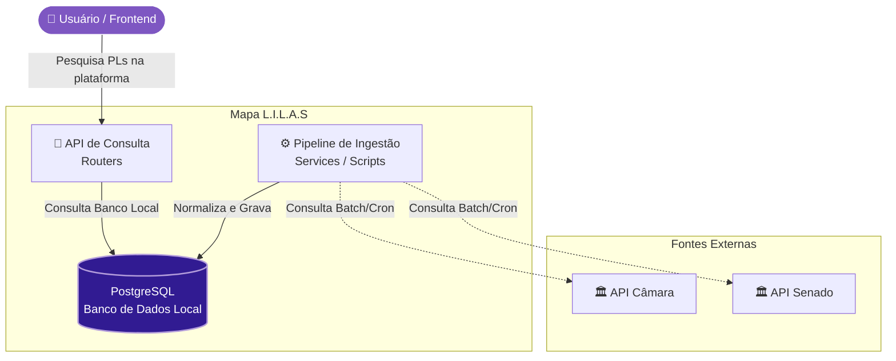

# 📖 Visão Geral da Arquitetura

> **Mapa Legislativo Informativo de Leis de Acompanhamento Social**
> Plataforma para busca e acompanhamento de projetos de lei sobre feminicídio e visualização de gráficos interativos.

---

## 1. Visão Geral

O **Mapa L.I.L.A.S** é uma aplicação web voltada à transparência legislativa. Os dados provêm das APIs públicas do Senado Federal e da Câmara dos Deputados, tornando a informação acessível, pesquisável e visual para jornalistas, pesquisadores e cidadãos.

### Objetivos Arquiteturais

| Atributo           | Meta                                                                 |
|--------------------|----------------------------------------------------------------------|
| **Disponibilidade**| Alta disponibilidade do frontend e da API                            |
| **Manutenibilidade**| Separação clara entre frontend, backend e dados                     |
| **Extensibilidade**| Facilidade para adicionar novas fontes legislativas                  |
| **Desempenho**     | Respostas rápidas com cache e persistência local dos dados           |
| **Rastreabilidade**| Classificação e anotação de PLs com NLP                             |

---

## 2. Level 1 — Mapa do Sistema

### Atores e Sistemas Externos

| Entidade | Tipo | Descrição |
|---|---|---|
| **Usuário** | Pessoa | Acessa a plataforma para buscar e monitorar PLs sobre feminicídio |
| **Mapa L.I.L.A.S** | Sistema | Plataforma principal que agrega, processa e exibe os dados |
| **API Senado Federal** | Externo | REST API pública com proposições e tramitações do Senado |
| **API Câmara dos Deputados** | Externo | REST API pública com projetos de lei e dados da Câmara |

---

## 3. Stack Tecnológica

| Camada | Tecnologia | Versão recomendada | Justificativa |
|---|---|---|---|
| **Frontend** | React | 18+ | Componentização e reatividade |
| **Estilização** | Tailwind CSS | 3+ | Utilitários rápidos e responsividade |
| **Backend** | Python | 3.11+ | Ecossistema NLP e integração com APIs |
| **Framework API** | FastAPI | 0.100+ | Performance, validação (Pydantic), docs OpenAPI |
| **Validação** | Pydantic | v2 | Tipagem forte dos modelos de dados |
| **Banco de Dados** | PostgreSQL | 15+ | Confiabilidade, queries complexas, suporte a JSONB |
| **APIs Externas** | Senado + Câmara | — | Dados legislativos federais oficiais |
| **NLP/Classifier** | Python (regex + NLP) | — | Classificação automática de PLs por tema |
| **Containerização** | Docker & Compose | — | Padronização e facilidade no deploy dos ambientes |
