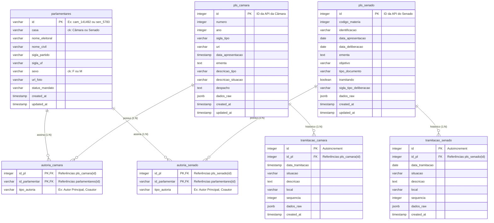

---
hide:
  - navigation
  - toc
---
# Relações entre Tabelas - Banco de Dados Mapa L.I.L.A.S.

Este documento apresenta uma visão detalhada das relações entre as tabelas do banco de dados do **Mapa L.I.L.A.S.**, mostra a arquitetura relacional baseada nos modelos implementados em `backend/app/models.py`.

---

## 1. Diagrama de Entidade-Relacionamento (ERD)

Abaixo está a representação visual de como as tabelas se relacionam no banco de dados:

---

## 2. Detalhamento das Relações em Tópicos

### 2.1. Parlamentares: A Tabela Centralizadora (Cross-House)
* **Objetivo:** Unificar parlamentares da Câmara dos Deputados e do Senado Federal em um único local, resolvendo divergências de formatação de APIs distintas.
* **Chave Primária Única:** O `id` do parlamentar é do tipo `VARCHAR` e utiliza prefixos para evitar colisões entre as duas casas legislativas (ex: `cam_141492` para deputados e `sen_5783` para senadores).
* **Integridade e Validações:**
  * Há uma `CheckConstraint` garantindo que o campo `casa` seja apenas `"Câmara"` ou `"Senado"`.
  * Há uma `CheckConstraint` garantindo que o campo `sexo` seja `"F"` ou `"M"`, o que possibilita análises estatísticas de autoria de gênero cruciais para o dashboard.

---

### 2.2. Relação de Autoria: Muitos-para-Muitos ($N:M$)
Como projetos de lei complexos possuem múltiplos autores ou coautores, e um parlamentar pode criar/assinar diversos projetos de lei, o relacionamento é do tipo **Muitos-para-Muitos**.

Esta relação é dividida por casa legislativa, utilizando tabelas intermediárias de junção (Join Tables):

#### A. Autoria na Câmara dos Deputados (`autoria_camara`)
* **Ligação:** Conecta `pls_camara` e `parlamentares`.
* **Chave Primária Composta:** Formada pela dupla `(id_pl, id_parlamentar)`. Isso garante a restrição de unicidade para evitar duplicidade de assinaturas do mesmo parlamentar no mesmo projeto.
* **Comportamento em Cascata (Cascade Delete):** Ambas as chaves estrangeiras possuem `ondelete="CASCADE"`. Se um projeto de lei ou um parlamentar for excluído do banco de dados, seus registros correspondentes em `autoria_camara` serão removidos automaticamente pelo banco de dados para evitar registros órfãos.
* **Atributo de Relacionamento:** Contém a coluna `tipo_autoria` (ex: `"Autor Principal"`, `"Coautor"`).

#### B. Autoria no Senado Federal (`autoria_senado`)
* **Ligação:** Conecta `pls_senado` e `parlamentares`.
* **Funcionamento:** Segue exatamente a mesma regra de chaves compostas e comportamento em cascata da Câmara, garantindo integridade referencial para as matérias do Senado.

---

### 2.3. Relação de Tramitação: Um-para-Muitos ($1:N$)
Cada projeto de lei possui um histórico contendo vários eventos/passos de sua tramitação ao longo do tempo. O relacionamento é do tipo **Um-para-Muitos** (um PL possui várias tramitações, mas cada registro de tramitação refere-se a um único PL).

#### A. Tramitação na Câmara (`tramitacao_camara`)
* **Ligação:** Conecta `pls_camara` a `tramitacao_camara` por meio da chave estrangeira `id_pl`.
* **Ordenamento Histórico:** Possui um campo `sequencia` (Integer) para garantir o ordenamento cronológico exato das tramitações na rota de detalhes do projeto.
* **Rastreabilidade:** Utiliza `dados_raw` (`JSONB`) para persistir o payload original da API da Câmara e `created_at` para registrar o momento exato em que a tramitação foi salva.

#### B. Tramitação no Senado (`tramitacao_senado`)
* **Ligação:** Conecta `pls_senado` a `tramitacao_senado` via chave estrangeira `id_pl`.
* **Funcionamento:** Segue a mesma estrutura de ordenamento por `sequencia`, permitindo que o painel exiba a evolução da matéria de forma progressiva e exata.

---

## 3. Notas Arquiteturais e de Performance

* **Consultas Unificadas (Cross-House Queries):** Como os projetos de lei e autorias estão em tabelas fisicamente separadas devido aos fluxos distintos da Câmara e do Senado, operações agregadas (ex: *"buscar todas as autorias de projetos de violência doméstica por gênero"*) são obtidas por meio de operações de `UNION` nas consultas SQL do back-end.
* **Uso de JSONB (`dados_raw`):** As tabelas `pls_camara`, `pls_senado`, `tramitacao_camara` e `tramitacao_senado` armazenam o objeto bruto de dados de suas respectivas APIs no campo `dados_raw`. Isso garante extensibilidade futura sem necessidade de constantes migrações de esquema no banco.
* **Cascade Delete-Orphan (SQLAlchemy):** As relações do SQLAlchemy em `models.py` estão configuradas com `cascade="all, delete-orphan"`. Ao excluir um objeto de Proposição (`PlCamara` ou `PlSenado`) em nível de ORM, todas as suas respectivas tramitações e autorias associadas são removidas automaticamente do banco de dados, protegendo a consistência referencial.
