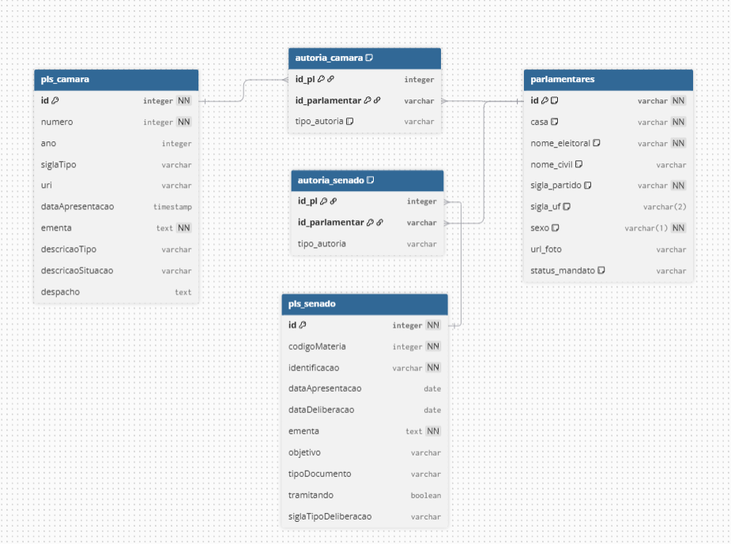

# Documentação do Banco de Dados: Mapa L.I.L.A.S.

Esta documentação descreve o esquema relacional desenvolvido para armazenar e monitorar Projetos de Lei (PLs) focados no combate à violência doméstica e feminicídio. A arquitetura foi otimizada para o PostgreSQL, garantindo alta performance na listagem de dados no dashboard e mantendo a integridade das informações extraídas das APIs da Câmara e do Senado.

---

## 1. Tabela Unificada: `parlamentares`

Esta é a tabela central que consolida todos os autores, resolvendo a diferença de formatação entre as APIs da Câmara e do Senado. Centralizar os parlamentares facilita métricas e filtros globais (ex: análise de gênero ou propostas por partido).

| Coluna | Tipo (PostgreSQL) | Regra | Descrição / Origem |
| --- | --- | --- | --- |
| **`id`** | `VARCHAR` | `PRIMARY KEY` | ID único com prefixo da casa para evitar conflitos (ex: `cam_141492` ou `sen_5783`). |
| **`casa`** | `VARCHAR` | `NOT NULL` | Identifica a origem: `"Câmara"` ou `"Senado"`. |
| **`nome_eleitoral`** | `VARCHAR` | `NOT NULL` | Nome público usado pelo político (Câmara: `nome` / Senado: `NomeParlamentar`). |
| **`nome_civil`** | `VARCHAR` | Opcional | Nome de registro completo. |
| **`sigla_partido`** | `VARCHAR` | Opcional | Partido atual do parlamentar. |
| **`sigla_uf`** | `VARCHAR(2)` | Opcional | Estado pelo qual o parlamentar foi eleito (ex: `RN`, `SP`). |
| **`sexo`** | `VARCHAR(1)` | `NOT NULL` | Campo crucial para análises do projeto (`F` ou `M`). |
| **`url_foto`** | `VARCHAR` | Opcional | Link direto para a foto oficial. |
| **`status_mandato`** | `VARCHAR` | Opcional | Situação atual (ex: `"Titular"`, `"Fim de Mandato"`). |

---

## 2. Tabelas de Projetos de Lei (PLs)

Como as casas legislativas possuem fluxos e dados de tramitação estruturalmente diferentes, os projetos de lei são armazenados em tabelas separadas. Ambas servem como um "cache" otimizado para o front-end, armazenando apenas o essencial para a listagem e busca.

### `pls_camara`

| Coluna | Tipo (PostgreSQL) | Regra | Descrição / Origem |
| --- | --- | --- | --- |
| **`id`** | `INTEGER` | `PRIMARY KEY` | ID interno da proposição na API da Câmara. |
| **`numero`** | `INTEGER` | `NOT NULL` | Número do PL. |
| **`ano`** | `INTEGER` | `NOT NULL` | Ano de apresentação do PL. |
| **`sigla_tipo`** | `VARCHAR` | `NOT NULL` | Sigla da proposição (ex: `PL`). |
| **`uri`** | `VARCHAR` | Opcional | URL base da API para buscar detalhes profundos em tempo real. |
| **`data_apresentacao`** | `TIMESTAMP` | Opcional | Data e hora exata em que o projeto foi submetido. |
| **`ementa`** | `TEXT` | `NOT NULL` | Texto descritivo da lei (usa `TEXT` para evitar cortes em descrições longas). |
| **`descricao_tipo`** | `VARCHAR` | Opcional | Descrição formal (ex: `"Projeto de Lei"`). |
| **`descricao_situacao`** | `VARCHAR` | Opcional | Status atual resumido (ex: `"Tramitando em Conjunto"`). |
| **`despacho`** | `TEXT` | Opcional | Último andamento ou decisão técnica registrada. |

### `pls_senado`

| Coluna | Tipo (PostgreSQL) | Regra | Descrição / Origem |
| --- | --- | --- | --- |
| **`id`** | `INTEGER` | `PRIMARY KEY` | ID numérico interno retornado no JSON. |
| **`codigo_materia`** | `INTEGER` | `NOT NULL` | Identificador universal do Senado, essencial para as rotas de detalhes. |
| **`identificacao`** | `VARCHAR` | `NOT NULL` | Nome completo formatado (ex: `"PL 2325/2021"`). |
| **`data_apresentacao`** | `DATE` | Opcional | Data de submissão do projeto. |
| **`data_deliberacao`** | `DATE` | Opcional | Data da última ação ou votação. |
| **`ementa`** | `TEXT` | `NOT NULL` | Texto descritivo completo da proposta legislativa. |
| **`objetivo`** | `VARCHAR` | Opcional | Classificação interna do Senado (ex: `"Iniciadora"`). |
| **`tipo_documento`** | `VARCHAR` | Opcional | Classificação do documento (ex: `"Projeto de Lei Ordinária"`). |
| **`tramitando`** | `BOOLEAN` | `NOT NULL` | Indica se o projeto ainda está ativo (`TRUE` ou `FALSE`). |
| **`sigla_tipo_deliberacao`** | `VARCHAR` | Opcional | Status formatado (ex: `"APROVADA_EM_COMISSAO_TERMINATIVA"`). |

---

## 3. Tabelas de Relacionamento (Muitos-para-Muitos)

Projetos complexos frequentemente possuem múltiplos autores e coautores. Para refletir a realidade do Congresso sem quebrar a integridade do banco de dados, utilizamos tabelas intermediárias de junção (N:M). Elas conectam os PLs aos seus respectivos parlamentares.

### `autoria_camara`

| Coluna | Tipo (PostgreSQL) | Regra | Descrição / Referência |
| --- | --- | --- | --- |
| **`id_pl`** | `INTEGER` | `PK`, `FK` | Chave estrangeira conectada a `pls_camara(id)`. Deleta em cascata. |
| **`id_parlamentar`** | `VARCHAR` | `PK`, `FK` | Chave estrangeira conectada a `parlamentares(id)`. Deleta em cascata. |
| **`tipo_autoria`** | `VARCHAR` | `NOT NULL` | Define o papel (ex: `"Autor Principal"`, `"Coautor"`). |

### `autoria_senado`

| Coluna | Tipo (PostgreSQL) | Regra | Descrição / Referência |
| --- | --- | --- | --- |
| **`id_pl`** | `INTEGER` | `PK`, `FK` | Chave estrangeira conectada a `pls_senado(id)`. Deleta em cascata. |
| **`id_parlamentar`** | `VARCHAR` | `PK`, `FK` | Chave estrangeira conectada a `parlamentares(id)`. Deleta em cascata. |
| **`tipo_autoria`** | `VARCHAR` | `NOT NULL` | Define o papel (ex: `"Autor Principal"`, `"Coautor"`). |

> **Nota de Implementação:** As chaves primárias nestas tabelas (`PK`) são compostas. Isso significa que a combinação exata de `id_pl` + `id_parlamentar` não pode se repetir na mesma tabela, garantindo que o banco de dados não registre o mesmo deputado assinando o mesmo PL duas vezes com a mesma função.

---

### Links Úteis
* Veja a [Documentação de Relacionamentos e Fluxo de Dados](relacionamento_tabelas.md) para um detalhamento maior com diagramas ER (Entidade-Relacionamento) de todas as tabelas, chaves e constraints do banco.