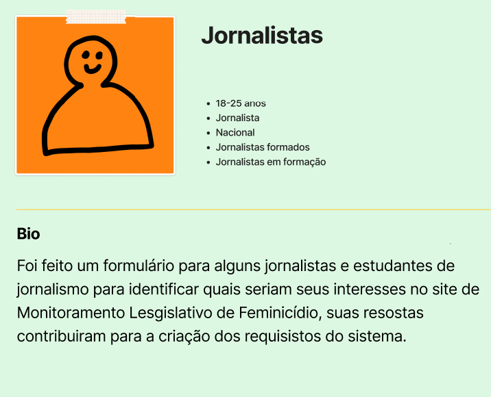
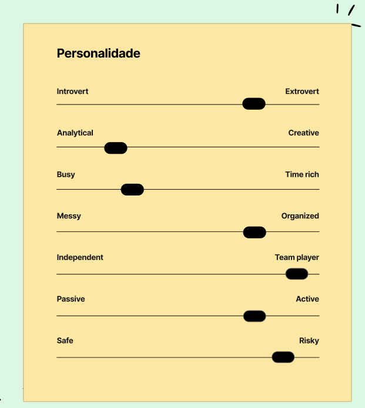
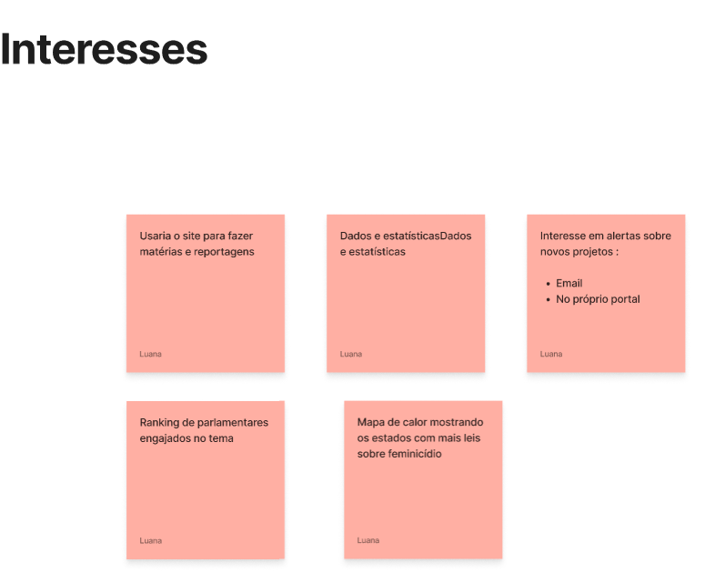
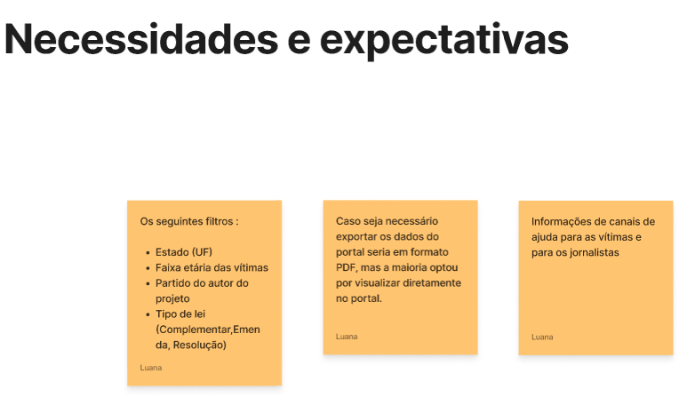
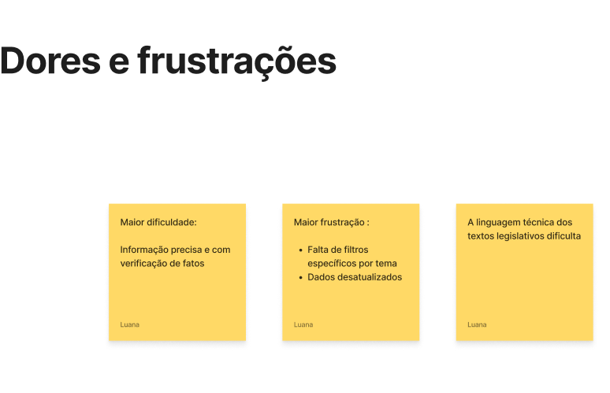

# Persona do Projeto

## Pesquisa sobre a persona do projeto

A persona definida para o nosso projeto foi os **jornalistas**, por isso foi realizada uma pequena pesquisa usando um formulário do Google Forms para identificar alguns pontos e também ajudar nos requisitos do projeto.

## Interesses

## Necessidades e Expectativas

## Dores e Frustrações 

## Conclusão

Com isso podemos identificar pontos importantes sobre nosso público alvo que vai ajudar no desenvolvimento do projeto.

---

Pesquisa e Documentação realizada por **Luana Barbosa** ([@Lulu-souza](https://github.com/Lulu-souza))