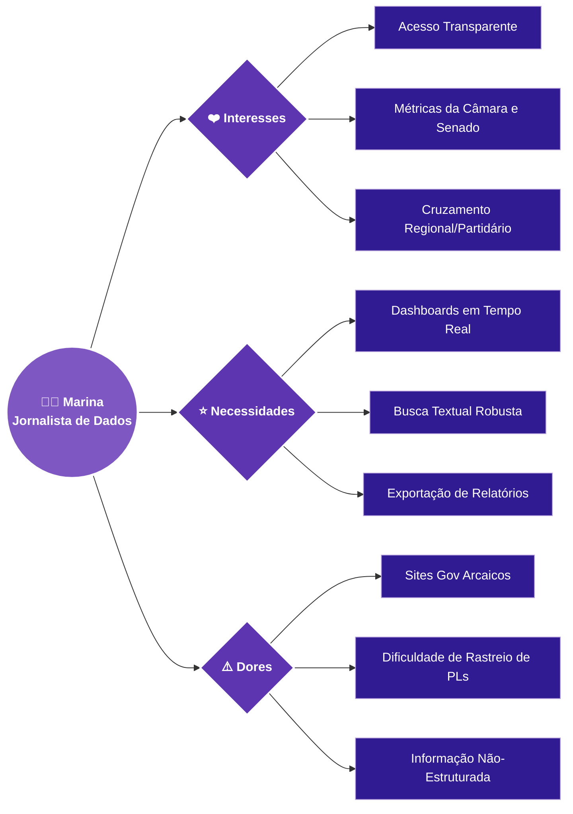

# 👩‍💻 Persona: A Jornalista de Dados

Com base na pesquisa inicial realizada com o nosso público-alvo (jornalistas e pesquisadores do meio político), estruturamos a **Persona** central que guiará as decisões de UX e desenvolvimento do **Mapa L.I.L.A.S**.

---

## 📌 Perfil Biográfico

**Nome Fictício:** Marina Alves  
**Idade:** 34 anos  
**Ocupação:** Jornalista Investigativa e Analista de Dados Políticos  
**Contexto:** Marina atua cobrindo pautas sobre direitos humanos e legislação na política nacional. O seu dia a dia consiste em investigar a eficácia e a movimentação de projetos de lei em Brasília.

### Personalidade
*   **Analítica:** Toma decisões embasadas em dados estatísticos e fontes oficiais.
*   **Ágil:** Precisa de informações rápidas devido à dinâmica do jornalismo (furos de reportagem).
*   **Crítica:** Cética em relação a promessas políticas vazias; ela quer ver os dados de aprovação.

---

## 🧠 Mapa Mental da Persona

Abaixo está o diagrama (Mindmap) que resume a psique da nossa Persona em relação ao domínio da plataforma:

---

## 🎯 Aprofundamento

-   ❤️ **Interesses**
    ---
    * Ter acesso consolidado às bases governamentais sobre a pauta do Feminicídio.
    * Entender quais partidos e estados são mais ativos em proposições femininas.
    * Acompanhar as comissões e votações ativas semanalmente.

-   ⭐ **Necessidades e Expectativas**
    ---
    * Um portal que consolide **Senado e Câmara** em uma única pesquisa.
    * Painéis que tragam os dados mastigados e prontos para publicar (Gráficos exportáveis).
    * Notificações visuais ou filtros fáceis para leis aprovadas recentemente.

-   ⚠️ **Dores e Frustrações**
    ---
    * Gasta horas do dia acessando múltiplos sites do governo com usabilidade ruim.
    * Os textos dos projetos muitas vezes são longos e escondem as reais intenções da lei.
    * É difícil justificar suas pautas para o editor chefe sem dados visuais de impacto.

---
Pesquisa e estruturação original idealizada por **Luana Barbosa** ([@Lulu-souza](https://github.com/Lulu-souza)), adaptada para formato sem imagens para otimização da documentação.
