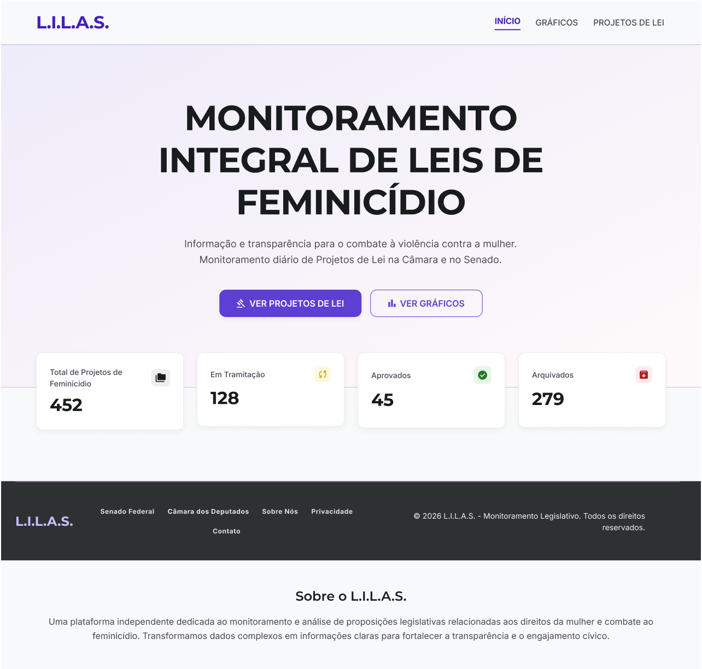
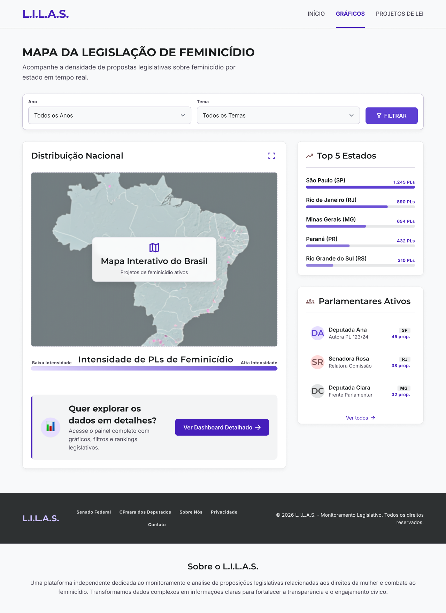
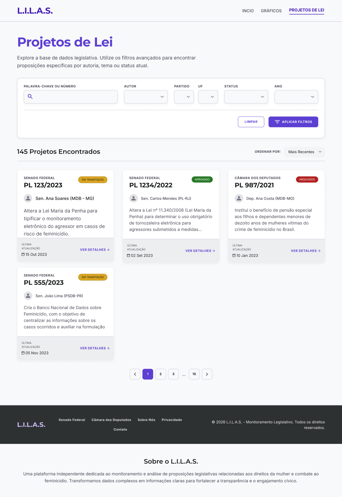

# Protótipo Alta Fidelidade — Mapa L.I.L.A.S.

> Documentação visual das telas projetadas para a plataforma L.I.L.A.S. — Monitoramento Legislativo do Feminicídio.

---

## INÍCIO

Página inicial da plataforma, apresentando o propósito do projeto e acesso às seções principais.

---

## GRÁFICOS

Página de visualizações gráficas com diferentes formas de análise dos dados legislativos.

---

## Dashboard — Gráfico de Barras Horizontais

Visualização dos dados em formato de barras horizontais para comparação entre categorias.

---

## Dashboard — Gráfico de Colunas

Visualização dos dados em formato de colunas verticais para análise temporal ou categórica.

---

## Dashboard — Gráfico de Pizza

Visualização proporcional dos dados em formato de pizza para análise de distribuição.

---

## Dashboard — Gráfico de Rosca

Variação do gráfico de pizza com espaço central, destacando proporções de forma visual.

---

## PL — Listagem de Projetos de Lei

Página principal de consulta legislativa com listagem paginada, filtros avançados e ordenação dos projetos de lei relacionados ao combate ao feminicídio.

---

## PL Detalhado

Página de detalhamento de um Projeto de Lei específico, com informações completas sobre autoria, tramitação e ementa.

---

## Ranking de Parlamentares

Página com ranking dos parlamentares mais ativos na proposição de projetos relacionados aos direitos da mulher e combate ao feminicídio.

---

## Parlamentares Detalhado

Página de perfil detalhado de um parlamentar, com histórico de proposições e engajamento legislativo.

