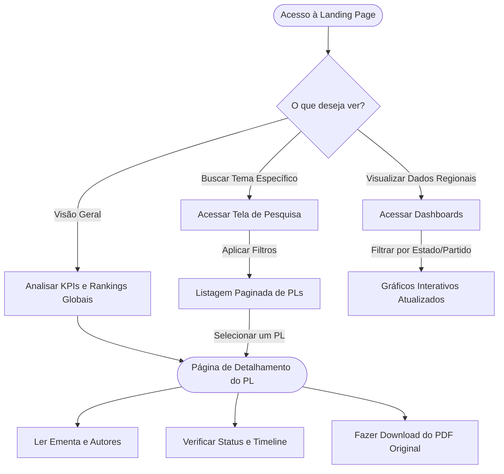

# Visão de Produto

Este documento detalha as diretrizes estratégicas e o escopo fundamental do **Mapa L.I.L.A.S**. Ele serve como bússola para o time de desenvolvimento e os stakeholders, guiando o que construímos e por quê.

---

## 🎯 Nível Estratégico

### Objetivos do Negócio e Necessidades dos Usuários
A plataforma tem como propósito central **democratizar o acesso e o acompanhamento das leis relacionadas ao feminicídio e aos direitos da mulher no Brasil**.

**Necessidades Identificadas:**
- **Jornalistas e Pesquisadores:** Necessitam de dados confiáveis, consolidados e gráficos estatísticos sobre quais estados e partidos mais propõem leis sobre o tema.
- **Cidadãos Comuns:** Querem entender rapidamente se há leis sendo votadas sobre violência doméstica e em qual estágio elas estão.
- **Gestão Pública:** Pode utilizar os mapas e dashboards para orientar políticas públicas.

---

## 📦 Escopo (Feature List)

Abaixo está o mapeamento de alto nível das funcionalidades do produto, agrupadas em 4 épicos principais:

!!! success "Lista de Funcionalidades"
    - **Dashboards e Estatísticas:** Geração de gráficos em tempo real (pizza, rosca, barra, mapa do Brasil por UF) e cruzamento de filtros avançados.
    - **Overview / Landing Page:** Painel unificado com KPIs (ex: total de PLs, top 5 estados, parlamentares mais ativos) e um feed cronológico das movimentações.
    - **Pesquisa de Proposições Legislativas:** Mecanismo robusto de busca unindo o Senado Federal e a Câmara dos Deputados.
    - **Raio-X do PL:** Página detalhada de cada projeto, com a ementa, status, histórico de tramitação (timeline) e download de documentos.

---

## 🔄 Estrutura (User Flow)

O fluxo do usuário dentro da aplicação foi pensado para ser intuitivo, com poucos cliques até a informação.

---

## ⚖️ Matriz de Impacto vs. Esforço

Para priorizar o nosso *Product Backlog*, avaliamos as features baseadas no retorno esperado (Impacto) e no custo de implementação (Esforço).

-   :material-star: **Alto Impacto, Baixo Esforço** (Quick Wins)
    ---
    Funcionalidades que devem ser priorizadas imediatamente.
    
    * Integração inicial básica com a API do Senado.
    * Busca simples por termos chaves.
    * Listagem de projetos cadastrados.

-   :material-trophy: **Alto Impacto, Alto Esforço** (Major Projects)
    ---
    Tarefas complexas, mas que definem o coração da aplicação.
    
    * Construção dos Dashboards Interativos.
    * Módulo classificador usando NLP para categorizar projetos automaticamente.
    * Agregação e normalização dos dados (Senado + Câmara).

-   :material-clock: **Baixo Impacto, Baixo Esforço** (Fill-ins)
    ---
    Melhorias complementares, feitas quando houver "gordura" na Sprint.
    
    * Compartilhamento nativo de links de PLs.
    * Filtros secundários de UI (ex: ordenação A-Z).

-   :material-close-circle: **Baixo Impacto, Alto Esforço** (Thankless Tasks)
    ---
    Itens que devem ser repensados ou colocados em *icebox* (não priorizados na V1).
    
    * Exportação hiper-personalizada de relatórios em múltiplos formatos além de PDF.
    * Integrações com redes sociais proprietárias (login oauth, etc) que não foquem no core do domínio.

